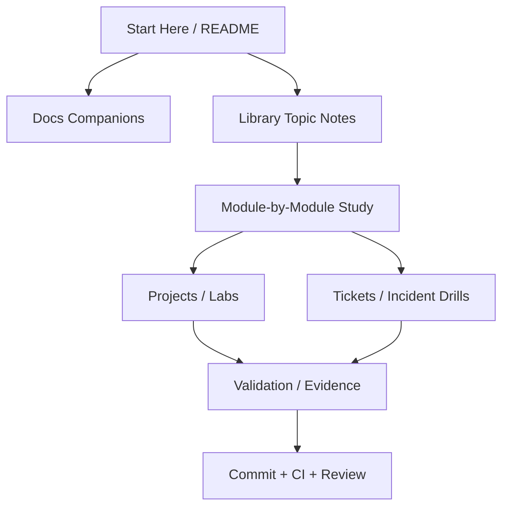
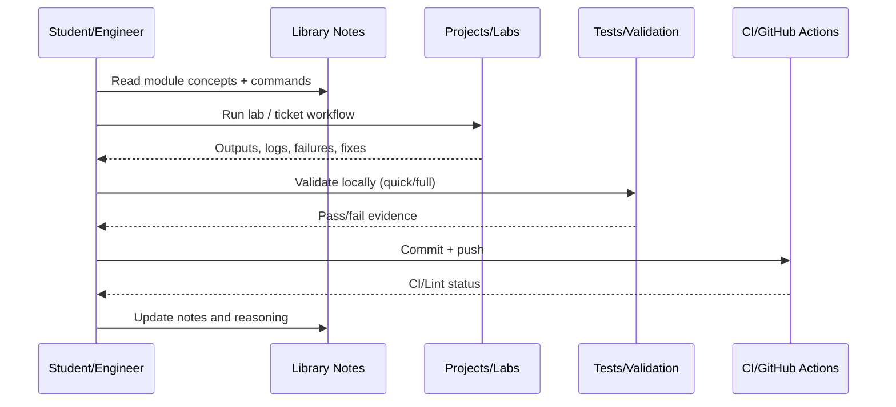
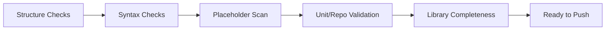

# Network Engineering and Security Foundation Full Course Master Guide (Single-File)

Author: Simon Parris + Codex consolidation pass
Date: 2026-02-24
Format: One-file course notes guide (Markdown) with diagrams and source map

This file consolidates the course notes into one markdown guide for offline/mobile review.
It preserves the modular `Library/*.md` files while providing a single-file study and revision path.

## What This Guide Includes

- Course map and study flow diagrams
- Quality/verification checklist aligned to repo CI and validation scripts
- Source map for `Library/`, `docs/`, `projects/`, and `tickets/`
- Combined notes from the `Library/` topic files in one place

## Course Architecture Diagram



## Learning Loop Diagram



## Quality Gate Diagram



## Source Map

### Library Files Included in This Guide

- `Library/00_full_course_cli_demo_sheet.md`
- `Library/00_full_course_q_and_a_sheet.md`
- `Library/01_START_HERE.md`
- `Library/01_networking_fundamentals.md`
- `Library/02_linux_network_cli.md`
- `Library/03_routing_and_subnetting.md`
- `Library/04_firewall_and_nat.md`
- `Library/05_dns_and_name_resolution.md`
- `Library/06_packet_analysis_and_observability.md`
- `Library/07_vpn_and_remote_connectivity.md`
- `Library/08_troubleshooting_and_incident_response.md`
- `Library/09_security_review_and_exposure.md`
- `Library/10_operational_runbooks_and_validation.md`
- `Library/11_segmentation_and_dhcp.md`
- `Library/12_security_monitoring_and_triage.md`
- `Library/13_advanced_infrastructure_services.md`

### Companion Docs (Referenced)

- `docs/01_START_HERE.md`

### Project and Ticket/Lab Paths (Top-Level Pointers)

- `labs/`
- `tests/`

## Combined Library Notes

_The sections below are combined from the modular `Library/*.md` files to create a single-file course guide._


---

## Source File: `Library/00_full_course_cli_demo_sheet.md`

# Full Course CLI Demo Sheet

## Baseline Host Triage (5-minute sequence)

```bash
ip -br link
ip -br addr
ip route show
ip route get 8.8.8.8
getent hosts example.com
ss -tulpn
sudo iptables -L -n -v
sudo tcpdump -ni any -c 10 host 8.8.8.8
```

## Namespace Router Build Demo (Labs 03/04/07 Pattern)

```bash
sudo ip netns add demo-client
sudo ip netns add demo-router
sudo ip netns add demo-server
# Create veth pairs, assign IPs, set routes, enable forwarding
```

## Firewall Verification Demo

```bash
sudo ip netns exec fw-router iptables -L FORWARD -n -v --line-numbers
sudo ip netns exec fw-client curl -sI --max-time 3 http://10.20.40.10:8080
```

## DNS Debugging Demo

```bash
sudo ip netns exec dns-client getent hosts lab6.test
sudo ip netns exec dns-client dig +short lab6.test
sudo ip netns exec dns-client dig @10.60.6.53 +short lab6.test
sudo tcpdump -ni br-l06 port 53 -c 20
```

## NAT Port Forward Validation Demo

```bash
sudo ip netns exec nat-router iptables -t nat -L -n -v
sudo ip netns exec nat-client curl -sI --max-time 3 http://10.10.70.1:8080
```


---

## Source File: `Library/00_full_course_q_and_a_sheet.md`

# Full Course Q&A Sheet (Network Engineering & Security Foundation)

## Foundations

### Q: Why can ping succeed while an application still fails?
A: ICMP success only proves some Layer 3 reachability. The application may still fail due to DNS, TCP port filtering, service bind address, service process state, or application-layer errors.

### Q: What command best proves Linux route selection to a destination?
A: `ip route get <destination>` because it shows the chosen interface, source IP, and next hop.

### Q: When does ARP happen for off-subnet traffic?
A: The host ARPs for the gateway MAC (next hop), not the remote destination host.

## Operations

### Q: Why is `ESTABLISHED,RELATED` important in firewall rules?
A: It allows return traffic for sessions you explicitly permitted, reducing rule count and preventing broken responses.

### Q: NAT rule exists but service still times out. What next?
A: Check `FORWARD` chain rules, `ip_forward`, service listener state, and packet counters/captures.

### Q: How do you prove DNS is the issue and not the network path?
A: Compare `dig @<server>` with default `dig`, inspect resolver config, and capture port 53 traffic.

## Security Awareness

### Q: What is the fastest way to inventory host exposure?
A: `ss -tulpn` plus firewall/NAT review (`iptables`, `ufw`) to compare listeners against policy intent.

### Q: Why is rule order critical in iptables?
A: `iptables` uses first-match behavior; an early `DROP` can shadow later allow rules.


---

## Source File: `Library/01_START_HERE.md`

# Long-Form Reference Library Start Here

## 1-x Order

1. Library README / usage - `README.md`
2. Course Q&A sheet - `00_full_course_q_and_a_sheet.md`
3. CLI demo sheet - `00_full_course_cli_demo_sheet.md`
4. Topic sequence - `01_networking_fundamentals.md -> 13_advanced_infrastructure_services.md`

## Notes

The topic files are already numerically ordered (`01` through `13`).


---

## Source File: `Library/01_networking_fundamentals.md`

# 01 - Networking Fundamentals

## Core Definitions

- Interface: Linux network device used to send/receive packets.
- Subnet: IP address range treated as directly connected by a host.
- Gateway: Next-hop router for off-subnet traffic.
- ARP: IPv4 mechanism to resolve next-hop MAC addresses on a local link.

## Why It Matters Operationally

Most outages are not caused by advanced routing protocols. They are caused by wrong IPs, wrong masks, missing routes, or service/listener assumptions.

## Command Mapping

```bash
ip -br link
ip -br addr
ip route show
ip neigh show
```

## Common Failure Signatures

- `Network is unreachable` -> no route/default route
- `Destination Host Unreachable` -> path/gateway/ARP issue near source
- Ping works, app fails -> likely service/firewall/DNS problem


---

## Source File: `Library/02_linux_network_cli.md`

# 02 - Linux Network CLI

## High-Value Commands

### `ip`
Use for interfaces, addresses, routes, neighbors.

```bash
ip -br addr
ip route get <target>
ip neigh show
```

### `ss`
Use for socket/listener state.

```bash
ss -tulpn
ss -tan state syn-sent
```

### `tcpdump`
Use for packet evidence.

```bash
sudo tcpdump -ni <iface> host <target>
```

### `dig` and `getent`
Use to separate resolver path issues from DNS server reachability issues.

```bash
getent hosts <name>
dig +short <name>
dig @<dns_server> +short <name>
```


---

## Source File: `Library/03_routing_and_subnetting.md`

# 03 - Routing and Subnetting

## Routing Decisions in Linux

Linux decides whether a destination is on-link or off-link using the interface prefix length and route table. Wrong subnet masks create misleading symptoms that look like switch or firewall issues.

## Practical Checks

```bash
ip addr show dev <iface>
ip route get <peer_ip>
traceroute -n <peer_ip>
```

## Fast Subnetting Notes

- `/24`: 254 usable hosts
- `/25`: two subnets of 126 usable hosts each
- `/27`: block size 32 (increments of 32)
- `/30`: point-to-point (2 usable hosts)


---

## Source File: `Library/04_firewall_and_nat.md`

# 04 - Firewall and NAT

## Stateful Filtering Pattern

```bash
iptables -P FORWARD DROP
iptables -A FORWARD -m conntrack --ctstate ESTABLISHED,RELATED -j ACCEPT
iptables -A FORWARD -s <src> -d <dst> -p tcp --dport <port> -j ACCEPT
```

## NAT Reminder

DNAT changes destination before routing, but packets still must pass `FORWARD` chain rules. NAT and filtering must be validated together.

## Key Debug Commands

```bash
sudo iptables -L -n -v --line-numbers
sudo iptables -t nat -L -n -v --line-numbers
sudo tcpdump -ni any 'port 80 or port 8080'
```


---

## Source File: `Library/05_dns_and_name_resolution.md`

# 05 - DNS and Name Resolution

## Resolver Path vs Direct DNS Queries

- `getent hosts <name>` tests the OS resolver path used by many applications.
- `dig +short <name>` tests DNS query behavior via configured resolver.
- `dig @<server> +short <name>` bypasses resolver config ambiguity.

## Failure Isolation Sequence

```bash
ping -c 2 <dns_server_ip>
cat /etc/resolv.conf
getent hosts <name>
dig @<dns_server_ip> +short <name>
sudo tcpdump -ni any port 53
```

## Common Root Causes

- Wrong nameserver IP
- UDP/53 blocked
- DNS service down or misbound
- Split-DNS mismatch (VPN/local resolver conflict)


---

## Source File: `Library/06_packet_analysis_and_observability.md`

# 06 - Packet Analysis and Observability

## What Packet Capture Proves

- Whether packets leave the host
- Whether replies return
- Whether TCP handshake completes
- Whether application data is exchanged after the handshake

## Useful Filters

```bash
sudo tcpdump -ni <iface> arp or icmp
sudo tcpdump -ni <iface> host <target> and port 53
sudo tcpdump -ni <iface> tcp port 80
```

## Latency / Loss Context

Combine capture evidence with `ping`, `traceroute`, and `tc qdisc show` when lab simulations intentionally add delay or loss.


---

## Source File: `Library/07_vpn_and_remote_connectivity.md`

# 07 - VPN and Remote Connectivity

## WireGuard Concepts (Operational)

- `wg0` is a virtual Layer 3 interface
- `AllowedIPs` controls route/policy behavior
- Handshake success does not prove remote subnet reachability

## Validation Commands

```bash
sudo wg show
ip addr show wg0
ip route show | grep wg0
sudo tcpdump -ni any udp port 51820
```

## Common Failure Pattern

Handshake exists, but remote subnet traffic fails because `AllowedIPs` excludes the remote subnet or local firewall/forwarding is missing.


---

## Source File: `Library/08_troubleshooting_and_incident_response.md`

# 08 - Troubleshooting and Incident Response

## Incident Triage Principles

1. Confirm scope and blast radius.
2. Collect evidence before changes.
3. Prove failing layer (interface, route, DNS, firewall, service).
4. Apply minimal corrective change.
5. Validate and document the final state.

## Ticket Evidence Starter Pack

```bash
ip -br addr
ip route show
ss -tulpn
sudo iptables -L -n -v --line-numbers
sudo tcpdump -ni any -c 20 host <target>
```

## Typical Root Cause Categories in This Repo

- Mask mismatch
- Missing default route
- IP forwarding disabled
- Firewall rule order issue
- NAT target IP/port mismatch
- DNS resolver misconfiguration


---

## Source File: `Library/09_security_review_and_exposure.md`

# 09 - Security Review and Exposure

## Quick Exposure Review Workflow

```bash
ss -tulpn
sudo iptables -L -n -v
sudo iptables -t nat -L -n -v
sudo ufw status verbose
```

## Review Questions

- Which services are listening, and on which bind addresses?
- Are they intentionally exposed?
- Do firewall and NAT rules match documented intent?
- Are temporary services still running after testing?

## Operational Security Insight

Most preventable network exposure incidents come from drift, temporary changes, or incomplete rollback rather than sophisticated attacks.


---

## Source File: `Library/10_operational_runbooks_and_validation.md`

# 10 - Operational Runbooks and Validation

## Why Validation Scripts Matter

Lab validation scripts provide repeatable PASS/FAIL checks that reduce ambiguity and force explicit end-state verification.

## Runbook Pattern Used in This Repo

- Objective and operational relevance
- Exact commands and expected outputs
- Misconfiguration simulation
- Debugging walkthrough
- Full solution and validation checklist
- Troubleshooting tree

## Documentation Hygiene Rules

- Real commands only (no pseudocode)
- Ubuntu LTS compatibility
- Permission notes included
- Expected outputs included
- No unresolved task markers or template stubs


---

## Source File: `Library/11_segmentation_and_dhcp.md`

# 11 - Segmentation and DHCP

## Scope

This section extends the foundation curriculum into VLAN tagging, Linux bridges, DHCP lease flow, and segmented service policy validation.

## Core Ideas

- VLAN tags identify Layer 2 segments on trunk links
- DHCP DORA relies on broadcast traffic and correct local scope/relay behavior
- Segmentation requires routing + policy + service binding alignment

## Commands to Memorize

```bash
ip -d link show type vlan
bridge vlan show
sudo tcpdump -ni <iface> 'udp port 67 or udp port 68'
sudo iptables -L FORWARD -n -v --line-numbers
```


---

## Source File: `Library/12_security_monitoring_and_triage.md`

# 12 - Security Monitoring and Triage

## Scope

Operational use of Suricata-style alerts and Zeek-style metadata for evidence-driven alert triage.

## Why It Matters

High alert volume without correlation leads to noise and bad decisions. A small CLI-based pipeline can rapidly classify common scan/policy alerts.

## Practical Tools

- `jq` for EVE JSON parsing
- `awk`/`grep` for Zeek TSV logs
- `tcpdump` for packet corroboration
- Host/firewall logs for disposition context


---

## Source File: `Library/13_advanced_infrastructure_services.md`

# 13 - Advanced Infrastructure Services (OSPF / VRRP / Load Balancing)

## Scope

Introductory operational checks for routing control-plane protocols, redundancy failover, and load-balancer health in lab environments.

## Key Distinction

- OSPF/VRRP: control-plane state and advertisements
- Load balancers: frontend/backends + health checks
- Data-plane symptoms often reflect hidden control-plane failures

## Baseline Checks

```bash
sudo vtysh -c 'show ip ospf neighbor' || true
ip addr show
ip neigh show
sudo haproxy -c -f /etc/haproxy/haproxy.cfg || true
```

